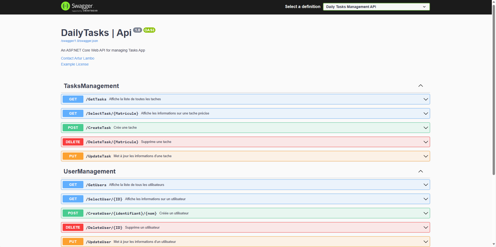

# Tasks_WEB-API
Mettre en place une API permettant d'exposer des dataset provenant d'une BD.
---------------------------------------------------------------------------------------------
## Mettre en place un swagger d'API openAInfos

## Les prerequis
### Soit via le prompt bash soit via NPM pour l'ajout des packages
- `dotnet new webapi -o TasksManagement_API`
- `dotnet add package Microsoft.EntityFrameworkCore.InMemory --version 5.0.10`
- `dotnet add package Microsoft.EntityFrameworkCore.Sqlite --version=5.0.10`
- `dotnet add package Microsoft.EntityFrameworkCore.Tools --version=5.0.10`
- `dotnet new xunit -n TasksManagement_Tests`
- `dotnet add package xunit --version=2.4.1`
- `dotnet add package xunit.runner.visualstudio --version=2.4.1`
- `dotnet add package BCrypt.Net-Next --version=4.0.3`
- Dans le projet de Test Unitaire ajouter
```
  <ItemGroup>
    <ProjectReference Include="..\TasksManagement_API\TasksManagement_API.csproj" />
  </ItemGroup>
  ``` 

## Tests 

- [X] Tests unitaires
    > - [X] Test de retour d'actions
    > - [X] Test d'accès aux differents endpoints
    

- [ ] Tests de charge
    > - [ ] Mettre en place des Threads permettant de simuler des appels simultanés sur l'api

- [ ] Tests de Sécurité
    > - [ ] Test d'injection SQL
    > - [ ] Test d'attaques XSS

## Sécuriser les endpoints d'Api
 
- [X] Mettre en place les authorisations (de base et/ou via un token de connexion)
  >  - [X]  Utilisateur Admin : token JWT
  >  - [X]  Utilisateur non-Admin : une authentification de base


## Créer une base de données
 
- [X] Créer un contexte de base de données en mémoire pour faire des tests sur l'api
- [X] Créer un modèle de données et les controleurs requis
- [X] Appliquer le principe SOLID 
- [ ] Utiliser SQLlite pour générer une base de données hébergée dans docker

## Representation

