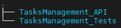
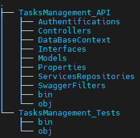
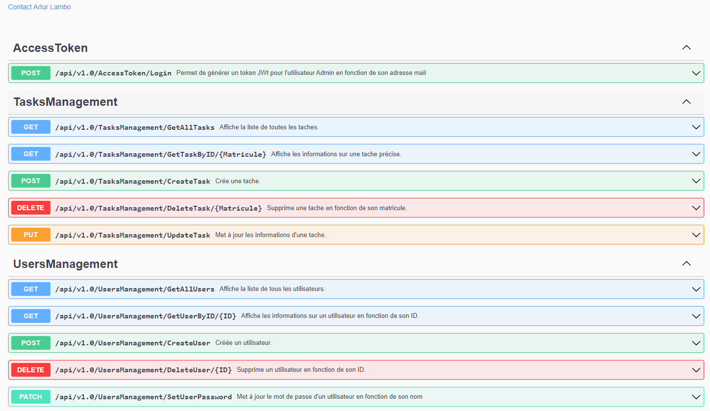

# DotnetApi project
----------------------------------------------------------------------------------------------------
Mettre en place une API swagger en net6.0
----------------------------------------------------------------------------------------------------

## 1- Les prérequis

### 1.1- Depuis la console 
On va créer 01 dossier DotnetApi contenant 02 dossiers pour notre application et les tests unitaires. 

 

#### 1.1.1- Création des deux projets
- `dotnet new webapi -o TasksManagement_API`
- `dotnet new xunit -n TasksManagement_Tests`


#### 1.1.2- Ajout des packages via la console ou depuis NugetPackageManagement 
- `dotnet add package Microsoft.EntityFrameworkCore.InMemory --version 6.0.0`
- `dotnet add package Microsoft.EntityFrameworkCore.Sqlite --version=6.0.0`
- `dotnet add package Microsoft.EntityFrameworkCore.Tools --version=6.0.0`
- `dotnet add package Microsoft.Extensions.Logging --version=6.0.0`
- `dotnet add package Microsoft.AspNetCore.Authentication.JwtBearer --version=6.0.0`
- `dotnet add package BCrypt.Net-Next --version=4.0.3`
- `dotnet add package xunit --version=2.4.1`
- `dotnet add package xunit.runner.visualstudio --version=2.4.1`

#### 1.1.3- Ajout du csproj TasksManagement_API dans le projet de Tests Unitaire
```
  <ItemGroup>
    <ProjectReference Include="..\TasksManagement_API\TasksManagement_API.csproj" />
  </ItemGroup>
``` 

## 2- Liens vers la version et l'etat de santé de l'api

- [ApiVersion](https://localhost:7082/version)
- [ApiHealthCheck](https://localhost:7082/health)

## 3- Organisation du code
- [X] Arborescence des dossiers
  > - [X] Création d'un dossier pour les filtres d'authentifications
  > - [X] Création d'un dossier pour les Interfaces
  > - [X] Création d'un dossier pour les filtres du Swagger
  > - [X] Création d'un dossier pour les services ou responsaiblités
  > - [X] Création d'un dossier pour un contexte de base de données
  > - [X] Création d'un dossier pour les modèles de données
  > - [X] Création d'un dossier pour les controllers

- [X] Principe SOLID
    > - [X] Single-Responsabilities
    > - [X] Interfaces-Segragation
    > - [X] Dependances-Inversion

 

## 4- Tests 

- [X] Tests unitaires
    > - [X] Test de retour d'actions
    > - [X] Test d'authentification
    
- [ ] Tests de charge
    > - [ ] Mettre en place des Threads permettant de simuler des appels simultanés sur l'api

- [ ] Tests de Sécurité
    > - [ ] Test d'injection SQL

## 5- Sécuriser les endpoints d'Api
 
- [X] Mettre en place les authorisations (de base et/ou via un token de connexion)
  >  - [X]  Utilisateur Admin : token JWT Bearer
  >  - [X]  Utilisateur non-Admin : une authentification de base {login:password}


## 6- Créer une base de données
 
- [X] Environnement de Développement : Base de Données en mémoire
- [ ] Environnement de Stagging : Base de Données via SQLite
- [ ] Environnement de Production : Base de Données en SQL via MySql (elle meme dans Docker)


## 7- Endpoints d'API

### 7.1- UsersManagementController 

> - `/api/v1.0/UsersManagement/GetAllUsers`
> - `/api/v1.0/UsersManagement/GetUserByID/?{id}`
> - `/api/v1.0/UsersManagement/CreateUser`
> - `/api/v1.0/UsersManagement/SetUserPassword/?{nom}?{mdp}`
> - `/api/v1.0/UsersManagement/DeleteUser/?{id}`

### 7.2- TasksManagementController

> - `/api/v1.0/TasksManagement/GetAllTasks`
> - `/api/v1.0/TasksManagement/GetTaskByID/{Matricule}`
> - `/api/v1.0/TasksManagement/CreateTask`
> - `/api/v1.0/TasksManagement/DeleteTask/{Matricule}`
> - `/api/v1.0/TasksManagement/UpdateTask`

## 8- Representation


