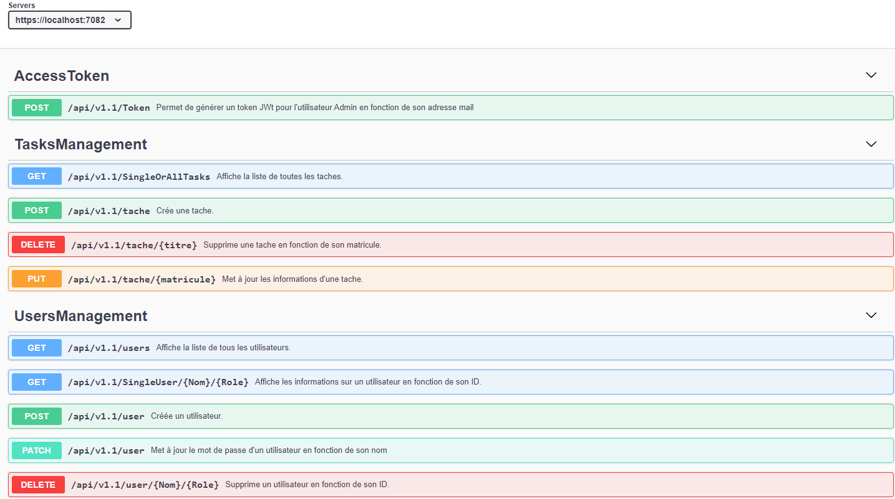

# DotnetApi project
----------------------------------------------------------------------------------------------------
Mettre en place une API swagger en net6.0
----------------------------------------------------------------------------------------------------

## Les prerequis

### Depuis la console 
On va créer 01 dossier DotnetApi contenant 02 dossiers pour notre application et les tests unitaires. 

 

#### Création des deux projets
- `dotnet new webapi -o TasksManagement_API`
- `dotnet new xunit -n TasksManagement_Tests`

 

#### Ajout des packages via la console ou depuis NugetPackageManagement 
- `dotnet add package Microsoft.EntityFrameworkCore.InMemory --version 6.0.0`
- `dotnet add package Microsoft.EntityFrameworkCore.Sqlite --version=6.0.0`
- `dotnet add package Microsoft.EntityFrameworkCore.Tools --version=6.0.0`
- `dotnet add package Microsoft.Extensions.Logging --version=6.0.0`
- `dotnet add package Microsoft.AspNetCore.Authentication.JwtBearer --version=6.0.0`
- `dotnet add package BCrypt.Net-Next --version=4.0.3`
- `dotnet add package xunit --version=2.4.1`
- `dotnet add package xunit.runner.visualstudio --version=2.4.1`

Dans le projet de Test Unitaire ajouter
```
  <ItemGroup>
    <ProjectReference Include="..\TasksManagement_API\TasksManagement_API.csproj" />
  </ItemGroup>
``` 

- [ApiVersion](https://localhost:7082/version)
- [ApiHealthCheck](https://localhost:7082/health)

## Tests 

- [X] Tests unitaires
    > - [X] Test de retour d'actions
    > - [X] Test d'accès aux differents endpoints
    
- [ ] Tests de charge
    > - [ ] Mettre en place des Threads permettant de simuler des appels simultanés sur l'api

- [ ] Tests de Sécurité
    > - [ ] Test d'injection SQL
    > - [ ] Test d'attaques XSS

## Sécuriser les endpoints d'Api
 
- [X] Mettre en place les authorisations (de base et/ou via un token de connexion)
  >  - [X]  Utilisateur Admin : token JWT Bearer
  >  - [X]  Utilisateur non-Admin : une authentification de base {login:password}


## Créer une base de données
 
- [X] Créer un contexte de base de données en mémoire pour faire des tests sur l'api
- [X] Créer un modèle de données et les controleurs requis
- [X] Appliquer le principe SOLID 
- [ ] Utiliser SQLlite pour générer une base de données hébergée dans docker

## Endpoints d'API

      UsersManagement 

> - `/api/v1.0/UsersManagement/GetAllUsers`
> - `/api/v1.0/UsersManagement/GetUserByID/?{id}`
> - `/api/v1.0/UsersManagement/CreateUser`
> - `/api/v1.0/UsersManagement/SetUserPassword`
> - `/api/v1.0/UsersManagement/DeleteUser/?{id}`

      TasksManagement

> - `/api/v1.0/TasksManagement/GetAllTasks`
> - `/api/v1.0/TasksManagement/GetTaskByID/{Matricule}`
> - `/api/v1.0/TasksManagement/CreateTask`
> - `/api/v1.0/TasksManagement/DeleteTask/{Matricule}`
> - `/api/v1.0/TasksManagement/UpdateTask`

## Representation


